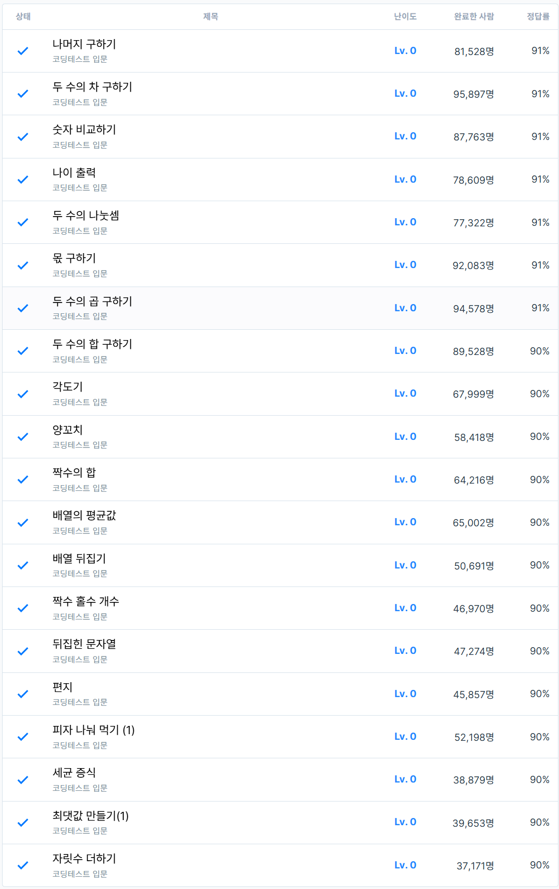

# 1주차 코딩테스트 연습 회고

1. 어려웠던 문제
    - 어려웠던 문제는 없습니다.
    - 다만, Javascript라는 새로운 언어를 사용해서, 그 문법에 익숙해지는데 시간이 필요했습니다.
2. 새롭게 알게 된 점
    
    ```jsx
    1. Math.trunc()
    : 입력 값 -> 변환할 숫자
    : 반환 값 -> 
    
    2. for문의 다양한 형태
    - for ( ... in ....): 배열의 인덱스를 하나씩 반환하는 형태
    - for ( ... of ...): 배열의 요소를 하나씩 반환하는 형태
    
    3. 자바스크립트 배열의 접근
    배열이름.push() : 데이터삽입
    배열이름.pop(): 데이터 추출
    
    4. 각 자리수 추출하는 방법
    -> 문자열로 변환
    -> split()으로 나눔
    -> map(Number)를 통해 숫자형 배열로 나열
    : 숫자.toString().split('').map(Number)
    ```
    
3. 궁금한 점
    - 없습니다.
4. 풀면서 느낀 점
    - 파이썬 만세!
    - 아직까지 Javascript에 익숙해지는데 시간이 필요하다는 느낌이 들었습니다.
        - 코딩테스트를 위한 문법/함수/라이브러리를 따로 정리해, 배워야 할 것 같습니다.
        - 필요하다면, 저희 지정 도서의 기초 문법 부분을 빠르게 읽고 가는 게 좋을 것 같습니다.
5. 문제 풀이 인증
    
    