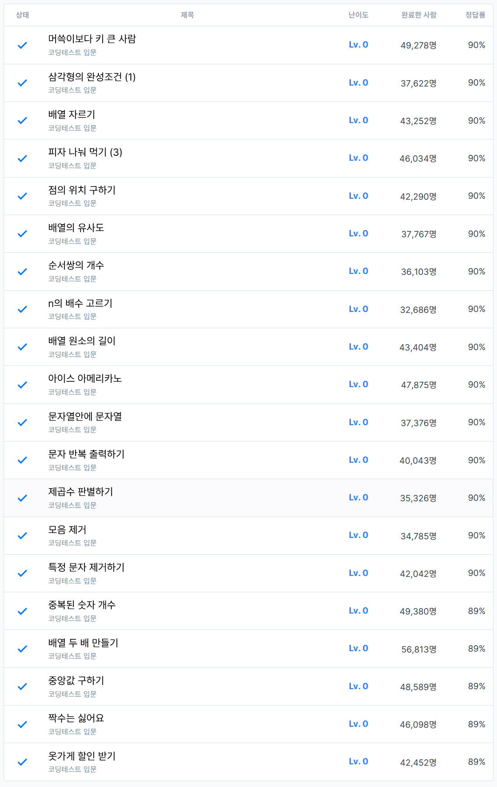

# 2주차 코딩테스트 연습 회고

1. 어려웠던 문제
    - 이번에는 어렵게 느껴졌던 문제들이 있었습니다. 
      - Javascript 문법이 익숙하지 않아서 그런 것도 있고, 자꾸 Python 문법으로 생각해서 그런 문제가 생기지 않았나 싶습니다.
    - 삼각형의 완성조건 (1)
      - max 값을 두고 나머지 두 변의 길이의 합과 비교하려니, 문제가 발생했습니다. 
      - 결국에는 세 변의 길이를 정렬하여 문제를 해결하였습니다.
      - 기존에 Python으로 풀었던 풀이를 보면서, 문제를 해결했습니다. 
    - 순서쌍의 개수
      - 이 중 for문으로 풀이를 시도하다가, 시간초과로 실패하였습니다. 
      - 결국에는 1~n까지의 수를 순회하면서, 해당 수가 약수(n과 i의 나머지 연산)인지 확인하는 방법으로 문제를 해결하였습니다.
      - 기존에 Python으로 풀었던 풀이를 보면서, 문제를 해결했습니다.
    - 문자열안에 문자열
      - 처음에는 어떻게 풀어야 할지 감이 오지 않았습니다.
      - 결국에는 문자열의 includes 메서드를 사용하여, 해당 문자열이 포함되어 있는지 확인하는 방법으로 문제를 해결하였습니다.
    - 모음 제거
      - 이중 for문과 문자열의 includes 메서드를 활용하여, 문제 풀이를 시도했으나 올바른 값이 출력되지 않았습니다.
      - replace 메서드와 정규표현식을 활용하여, 모음을 제거하는 방법으로 문제를 해결하였습니다.
    - 특정 문자 제거하기
      - replace 메서드와 정규표현식을 활용하여, 문제풀이를 시도했으나 변수이름을 바꿔야할 문자(정규표현식)로 인식하는 문제가 있었습니다.
      - replaceAll 메서드를 사용하여, 해당 문제를 해결하였습니다.
    - 중앙값 구하기
      - sort 메서드의 정렬 방향을 정하지 않아, 조금 헤매었습니다.
2. 새롭게 알게 된 점
    
    ```javascript
   // Math.max(): 배열에서 가장 큰 수를 찾는 방법
   const array = [1,2,3,4,5];
   const maxNumber = Math.max(...array);
   
   // String.includes(): 문자열에서 특정 문자열을 포함하는지 확인하는 방법
   const str = "Hello, World!";
   const str2 = "World";
   const contains = str.includes(str2);
   
   // typeof: 데이터 타입 확인하기
    typeof "Hello"; // "string"
    typeof 123; // "number"
    typeof true; // "boolean"
    typeof null; // "object" (JavaScript의 특성상 null은 object로 반환됨)
    typeof undefined; // "undefined"
   
   // 실수 여부 판별하기
   // isInteger() 메서드를 사용
    const isInteger = Number.isInteger(4.5); // false
   // 나머지 연산자(1로 나누기)를 사용
    const isInteger = 4.5 % 1 === 0; // false
    ```
    
3. 궁금한 점

    - 코드 가독성 등을 위해 변수 선언을 많이 하는 편인데, 공간복잡도에 영향을 미치지 않을까 생각합니다.
     ```javascript
    // 변수 선언을 많이 하는 코드
    const numbers = [1, 2, 3, 4, 5];
    const sum = numbers.reduce((acc, num) => acc + num, 0);
    const average = sum / numbers.length;
    console.log(`Sum: ${sum}`);
    console.log(`Average: ${average}`);
   
    // 변수 선언을 최소화한 코드
    const numbers = [1, 2, 3, 4, 5];
    console.log(`Sum: ${numbers.reduce((acc, num) => acc + num, 0)}`);
    console.log(`Average: ${numbers.reduce((acc, num) => acc + num, 0) / numbers.length}`);
     ```

4. 풀면서 느낀 점

    - for문을 너무 많이 사용하여, 추후 문제에서 시간복잡도가 증가하는 경우가 생길 수도 있을 것 같습니다.
      - 배열 내장 함수 등을 최대한 활용하여, for문을 줄이는 연습이 필요할 것 같습니다.
    - 문자열의 패턴 관련한 문제는 정규표현식을 활용하는 연습이 필요할 것 같습니다.

5. 문제 풀이 인증
