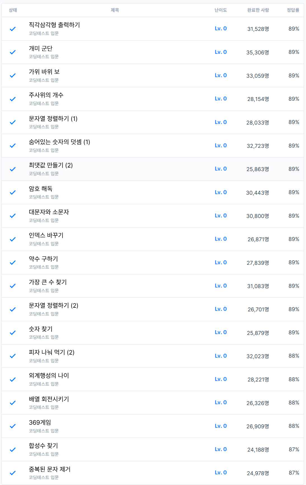

# 3주차 코딩테스트 연습 회고

1. 어려웠던 문제
    - 직각삼각형 출력하기: 문제 풀이 코드 작성하는 방법을 몰라서 헤맸음
    - 피자 나눠 먹기 (2): 최소 공배수 문제인데, 이를 수학적인 방법으로 떠올리지 않아 어려웠음
    - 합성수 찾기: 합성수를 찾는 공식/방법이 생각나지 않아 어려웠음
2. 새롭게 알게 된 점
- 대/소문자 변환
    - `toLowerCase()`와 `toUpperCase()` 메서드를 사용하여 문자열의 대/소문자를 변환할 수 있음
    - 예시 코드
        ```javascript
        let str = "Hello World!";
        console.log(str.toLowerCase()); // "hello world!"
        console.log(str.toUpperCase()); // "HELLO WORLD!"
        ```
- 숫자 변수 초기화: Infinity를 이용하여 최대/최소값으로 초기화
    - 예시 코드
        ```javascript
        let min = Infinity; // 최소값 초기화
        let max = -Infinity; // 최대값 초기화
        ```
- Node.js에서 표준 입력을 처리하는 방법
  - `readline` 모듈을 사용하여 표준 입력을 처리할 수 있음
  - 아래는 `readline` 모듈을 사용한 예시 코드

    ```javascript
    const readline = require('readline');
    const rl = readline.createInterface({
        input: process.stdin,
        output: process.stdout
    });
    
    let input = [];
    
    rl.on('line', function (line) { // 입력된 한 줄을 처리
      console.log(line);
      rl.close();
    }).on('close', function () { // 입력이 끝났을 때 호출되는 함수
      process.exit();
    });
    
    // 참고자료: https://socaeri.com/entry/Node-JS-readline-%EB%AA%A8%EB%93%88%EB%A1%9C-%EC%9E%85%EC%B6%9C%EB%A0%A5-%EB%B0%A9%EB%B2%95
    ```
- 코드 실행 시간을 측정하는 방법
  - console.time()과 console.timeEnd()를 사용하여 코드 실행 시간을 측정
  ```javascript
  console.time(); // 측정 시작

   for (let i = 0, sum = 0; i < 100000; i++) {
       sum += i;
   }
    
   console.timeEnd(); // 측정 종료
  
  // 참고자료: https://inpa.tistory.com/entry/JS-%F0%9F%9A%80-%EC%9E%90%EB%B0%94%EC%8A%A4%ED%81%AC%EB%A6%BD%ED%8A%B8-%EC%BD%94%EB%93%9C-%EC%8B%A4%ED%96%89-%EC%8B%9C%EA%B0%84-%EC%B8%A1%EC%A0%95-3%EA%B0%80%EC%A7%80-%EB%B0%A9%EB%B2%95
  ```
- 대부분의 경우, 내장함수를 사용하는 것이 더 효율적이고 빠를 수 있음
  - 직각삼각형 출력하기.js: repeat() 함수를 이용하는 것이 더 빠름
    ```javascript
    function measurePerformance(func, iterations = 100000) {
        console.time('performance');
        for (let i = 0; i < iterations; i++) {
            func();
        }
        console.timeEnd('performance');
    }
    
    function test1() { // performance: 19.424ms
        const n = 5;
        for(let i = 1; i <= n; i++){
            let star_line = "";
            for(let j = 0; j < i; j++){
                star_line += "*";
            }
        }
    }
    
    function test2() { // performance: 16.692ms
        const n = 5;
        for(let i = 1; i <= n; i++) {
            '*'.repeat(i);
        }
    }
    
    measurePerformance(test1); // performance: 19.424ms
    measurePerformance(test2); // performance: 16.692ms
    ```
    - 가위바위보.js: .map() 함수를 이용하면 속도가 빠름
      ```javascript
      // 테스트 데이터
      const testData = "2050525020502050";
    
      // 성능 측정 함수
      function measurePerformance(func, data, iterations = 100000) {
          console.time(`${func.name} 성능 측정`);
          for (let i = 0; i < iterations; i++) {
              func(data);
          }
          console.timeEnd(`${func.name} 성능 측정`);
      }
    
      // 방법 1: for...of 반복문 사용
      function solution1(rsp) { // solution1 성능 측정: 38.215ms
          var answer = '';
    
          for (r of rsp) {
              if (r == "2") {
                  answer += "0";
              } else if (r == "0") {
                  answer += "5";
              } else if (r == "5") {
                  answer += "2";
              }
          }
    
          return answer;
      }
    
      // 방법 2: map() 함수 사용
      function solution2(rsp) { // solution2 성능 측정: 33.223ms
          return rsp.split('').map(r => {
              if (r === "2") return "0";
              if (r === "0") return "5";
              if (r === "5") return "2";
          }).join('');
      }
    
    
    
      measurePerformance(solution1, testData);
      measurePerformance(solution2, testData);
      ```
    - 주사위의 개수.js: 짧은 배열에서는 구조분해보다, 반복문이 더 효율적일 수 있음.
      - 특히 이 코드에서는 Math.floor()를 3번이나 호출하여, 실행속도를 더 늦추고 있음
      - 구조분해의 장점은 성능보단, 가독성과 명확성에 있음
        ```javascript
        // 테스트 데이터
        const testBox = [10, 8, 6];
        const testN = 3;
    
        // 성능 측정 함수
        function measurePerformance(func, box, n, iterations = 1000000) {
            console.time(`${func.name} 성능 측정`);
            for (let i = 0; i < iterations; i++) {
                func(box, n);
            }
            console.timeEnd(`${func.name} 성능 측정`);
        }
    
        // 방법 1: for...of 반복문 사용
        function solution1(box, n) { // solution1 성능 측정: 18.01ms
            var answer = 1;
    
            for (b of box) {
                answer *= Math.trunc(b/n);
            }
    
            return answer;
        }
    
        // 방법 2: 구조 분해 할당 사용
        function solution2(box, n) { // solution2 성능 측정: 25.632ms
            let [width, length, height] = box;
    
            return Math.floor(width / n) * Math.floor(length / n) * Math.floor(height / n);
        }
    
        measurePerformance(solution1, testBox, testN);
        measurePerformance(solution2, testBox, testN);
        ```
3. 궁금한 점
    - 여러분도 스터디 문제 풀이 하시면서, 양이 많다고 느끼시나요?
      - 그렇다면, 문제 풀이의 양을 조절해보는 건 어떨까요?
      - 앞으로 프로젝트 기간에는 문제 풀이의 양을 조절할 필요가 있다고 합니다. (by 주강사님)
    
4. 풀면서 느낀 점
    - 문제 풀이를 하면서, 코드의 실행 시간을 측정하는 방법을 알게 됨
      - 내장 함수가 대부분의 경우에서 효율적임
      - 구조분해는 성능보다는 가독성과 명확성에 더 큰 장점이 있음

5. 문제 풀이 인증
