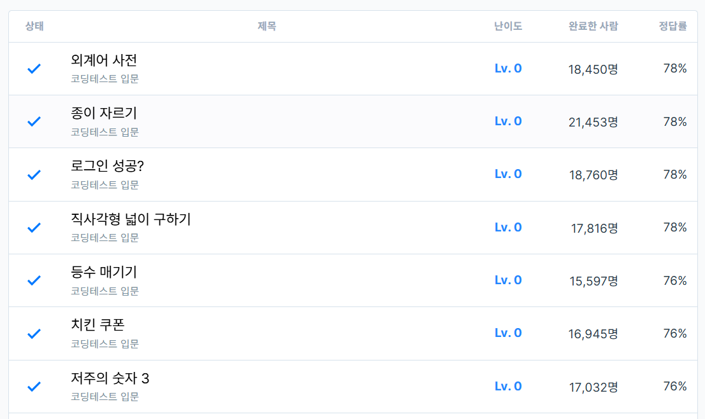

# 6주차 코딩테스트 연습 회고

1. 어려웠던 문제
    - 외계어 사전
      - 처음에는 어떤 방향으로 접근해야 할 지 몰랐으나, GPT에게 질문하여 힌트를 얻었습니다.
      - 문자열을 둘 다 sort 한 후, 비교하여 쉽게 풀 수 있었습니다.
    - 로그인 성공?
      - 채점 테스트케이스에서 걸려서, GPT에게 질문하여 힌트를 얻었습니다.
      - 한번에 비교해야 하는 것을 for문으로 하나씩 비교하려고 했던 것이 문제였습니다.
    - 직사각형의 넓이 구하기
      - 채점 테스트케이스에서 걸려서, GPT에게 질문하여 힌트를 얻었습니다.
      - Math.min, Math.max를 사용하여 풀어야 할 것을, (입출력 예시를 보고) 좌표값을 고정하여 푼 것이 문제였습니다.
    - 등수 매기기
      - GPT에게 질문하여, 등수를 구하는 방법에 대한 힌트 및 정답을 얻었습니다.
    - 치킨 쿠폰
      - 남은 쿠폰을 고려하지 않아서, 무료 치킨 수가 적게 계산되는 문제점이 있었습니다.
      - GPT에게 질문하여, 정답 코드를 얻었습니다.

2. 새롭게 알게 된 점
    - 없습니다.
    
3. 궁금한 점
    - 없습니다.

4. 풀면서 느낀 점
    - 모를 땐 GPT를 이용해 힌트를 얻고, 다른 사람의 코드를 이용해 새로운 풀이법을 공부하는 것이 베스트인 것 같습니다.

5. 문제 풀이 인증
