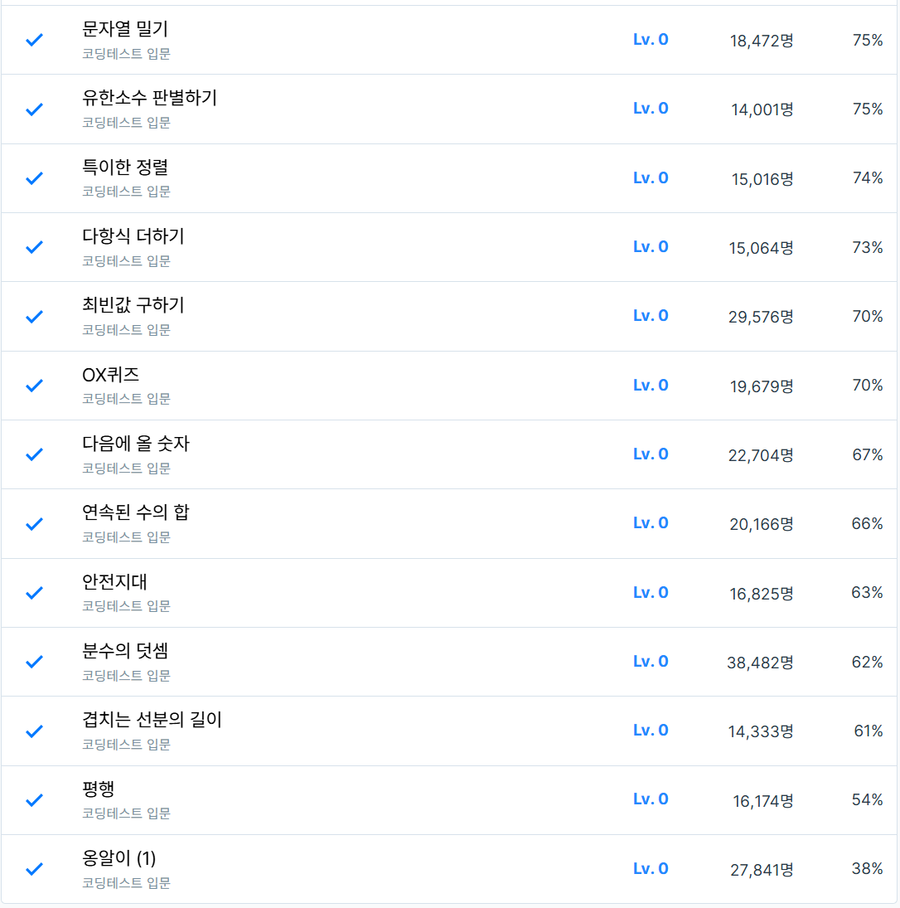

# 8주차 코딩테스트 연습 회고

1. 어려웠던 문제
    - 안전지대
      - 문제 풀이법을 풀고, 풀이 코드까지 작성했지만
      - 일부 에러를 GPT가 잡아주어, 빠르게 해결할 수 있었다.
    - 평행
      - 문제 풀이법을 생각했지만, 틀리게 접근하였다.
      - GPT를 통해 다른 접근법을 받아, 문제를 풀게 되었다.
    - 겹치는 선분의 길이, 분수의 덧셈
      - GPT로 부터 힌트를 받아, 구현하였다.
      - 에러가 발생한 부분을 GPT를 통해 알 수 있었다.
    - 옹알이 (1)
      - 생각했던대로, 정규표현식 패턴이 풀리지 않아, GPT의 도움을 받았습니다.
2. 새롭게 알게 된 점
    - 2차원 배열을 선언 및 초기화하는 방법
    ```jsx
        // 자바스크립트는 2차원 배열을 배열에 배열을 선언하게 된다. 이는 다른 언어와는 다른 방식이다.
        let dangerZone = Array.from(Array(len), () => Array(len).fill(0))
    ```
    - 문자열과 정규표현식의 패턴이 일치하는지 찾는 함수 (여러 번 해당하는 것도 찾을 수 있음)
    ```jsx
        const str = "table football";
        const regex = /fo+/;
    
        console.log(regex.test(str)); // return: true
    ```
3. 궁금한 점
    - 앞으로 책은 얼마나 더 어려울까...?
    - 앞으로 책의 진도는 어떻게 나갈까요?
      - 1안: 이론 1주, 문제 풀이(1개) 1주
      - 2안: 이론 1주, 문제 풀이(전체) 1주
      - 3안: 이론+문제 풀이 1주

4. 풀면서 느낀 점
    - 상동

5. 문제 풀이 인증
